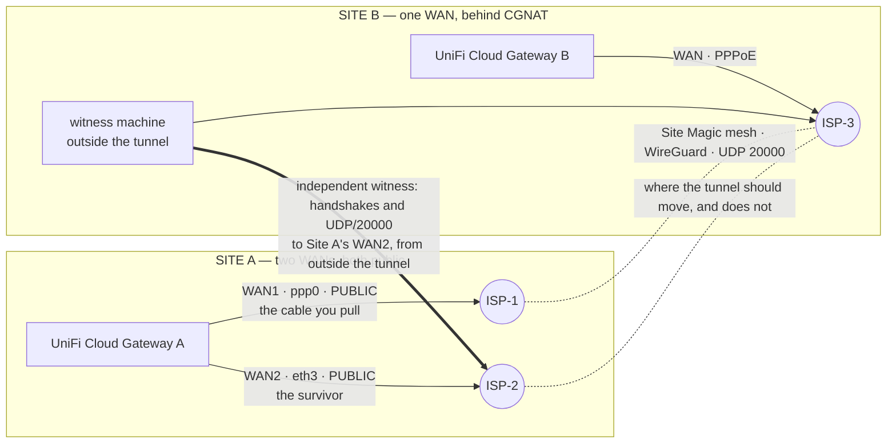

# Does UniFi Site Magic / SD-WAN Mesh fail over between WANs?

This is the harness that produced the evidence in Ubiquiti support ticket
#5927426. Seven reproductions between 1 and 24 September 2026, each one by
physically pulling a WAN cable, with both gateways instrumented from the inside.
On 27 September the vendor's escalation team reviewed those runs and wrote that
the measured behaviour does not match the expected failover behaviour.

Nothing here is a demo or a re-creation. It is the same script, with the site
constants turned into parameters and my own addresses removed.

## The claim it tests

> On a pair of UniFi Cloud Gateways joined in a Site Magic / SD-WAN **Mesh**
> group, when the primary WAN of the two-WAN site goes down, the mesh tunnel
> does not come back over the surviving WAN, even though that WAN keeps
> carrying all other traffic and stays reachable from the Internet.

Narrow on purpose, and falsifiable. If your tunnel recovers, the run says so and
that result is worth posting too.

## The architecture you need

The failure needs a specific, and very ordinary, asymmetry: one site with two
public WANs, the other behind carrier-grade NAT.



| you need | why |
|---|---|
| two UniFi gateways in the same Site Magic **Mesh** group | Mesh, not Hub-and-Spoke. Hub-and-Spoke is where tunnel failover exists, and most gateways are not eligible to be a hub |
| site A with **two working WANs, both holding public addresses** | if the surviving WAN is not public, the vendor's first answer is that the precondition was not met |
| site B **behind CGNAT** (an address in `100.64.0.0/10`) | this is the whole point. The cloud provisions site B's *internal* CGNAT address as the peer endpoint. When WAN1 dies, site A discards the public endpoint it learned and falls back to that address, which cannot exist on the Internet |
| a **witness machine at site B**, on site B's own carrier, routed outside the tunnel | it proves site A's surviving WAN was publicly reachable for the whole outage. Without it, "your other WAN was down" is an unanswerable objection |
| SSH on both consoles | UniFi consoles take a **root password**; there is no `authorized_keys` and no supported way to add a key |
| the ability to unplug the primary WAN for 15 minutes | shorter windows invite "you did not wait long enough" |

If you only have the two gateways and no witness machine, the run still works and
still answers the question. You lose the ability to close that one objection.

## Why CGNAT is the hinge

Before the cut, WireGuard on site A is using the endpoint it **learned** from
site B's inbound handshake, which is a real public address. The cloud, meanwhile,
has written a different endpoint into the daemon's own config: site B's internal
CGNAT address.

About twenty seconds after the cable comes out, site A's log says so in its own
words, and the run captures it:

```
wireguard-interface: wgsts1000 has to be reconfigured to restore remote IP to <site B CGNAT address>
```

From that moment the gateway spends the whole outage initiating handshakes, over
the surviving WAN, to an address no ISP customer can be reached at. The other
site does the mirror image: it keeps aiming at site A's dead WAN1, because that
is the only address its own cloud configuration ever had.

## What the run does

1. **Finds the target instead of assuming it.** The tunnel can be asymmetric, so
   pulling "the WAN1 cable" blind can test nothing. Step zero reads which
   interface the tunnel is actually leaving by.
2. **Takes a baseline** on both gateways: tunnel state, the endpoint the cloud
   provisioned, policy rules, routes, interface addresses.
3. **Arms site B before the cut.** Site B is only reachable through the mesh, so
   it vanishes when the tunnel drops. Everything there is started detached, with
   a ceiling, and collected when the tunnel returns. Nothing is touched at site B
   during the window.
4. **Publishes and launches the witness probe** as a Windows scheduled task, not
   a child process. Measured the hard way on 19 September: a detached process
   dies with the SSH session and the script still reports success.
5. **Tells you when to pull the cable**, then samples the gateway every two
   seconds for the whole window: link state of both WANs, default route, the
   endpoint in use, the provisioned endpoint, handshake counters, route to peer.
6. **Captures packets on four interfaces** and runs the witness from outside.
7. **Walks you through the console tasks** while the cable is out: support files
   from both consoles and simultaneous WAN packet captures, which is what the
   vendor asked for after conceding the mechanism.
8. **Puts the cable back, collects everything, verifies it**, and writes a
   `RESUMO.md` where every number carries the exact command to re-derive it, plus
   a SHA-256 manifest of every file.

Every timestamp comes from one clock, the gateway's own, in ISO-8601 with offset.

## Run it

```sh
git clone https://github.com/rockettes/unifi-site-magic-wan-failover
cd unifi-site-magic-wan-failover
cp .env.example .env     # fill in your gateways, console password, witness host
./scripts/failover-prova-guiada.sh --ensaio    # dry run: validates everything, touches nothing
./scripts/failover-prova-guiada.sh             # the real thing, 900 s window
```

Useful flags:

| flag | what it does |
|---|---|
| `--ensaio` | dry run. Checks reachability, tooling and permissions, changes nothing |
| `--janela 1800` | longer window |
| `--porta 4` | cut the other WAN instead of the tunnel's current exit |
| `--sem-painel` | skip the console support-file and packet-capture walkthrough |
| `--sem-push` | do not push the resulting package anywhere |

⚠️ **Run it from a machine on site A's LAN**, not across the tunnel you are about
to break.

## What you get

A directory per run, with the raw material and a summary:

```
RESUMO.md                every number, and the command to re-derive it
eventos.log              timeline on one clock, plus the script's own SHA-256
manifesto.sha256         hash of every file in the package
00-linha-de-base.txt     full state before the cut, both the learned and the
                         provisioned endpoint, policy rules, route to peer
02-amostra-gateway.log   one sample every 2 s through the whole window
03-estado-final.txt      the same state at the end of the run
04-sonda-externa-*.log   the witness, from outside: could anyone reach site A's
                         surviving WAN during the outage
06-sonda-udp-*.log       UDP/20000 from site B to site A's surviving WAN
pv-*.pcap                captures on the failing WAN, the surviving WAN, and the
                         tunnel, filtered by peer endpoint and by port
```

## What to post, and what not to

Post the `RESUMO.md` and your gateway model and firmware version. That is enough
for anyone to judge the result.

⛔ **Do not post the packet captures or the support files.** They are your
network: internal addresses, device names, every host that spoke during the
window. The vendor can have them, in a ticket. A forum cannot. The script
generates them because the vendor asks for them, not so you can publish them.

## Provenance, and what is not verified

The seven runs are in the ticket. The script's own SHA-256 and the hash of its
measurement section are stamped into every package it writes, so a package can
be tied to the exact code that produced it.

What changed for publication: site constants became parameters, my WAN and CGNAT
addresses became placeholders, carrier names became `ISP-1`/`ISP-2`, support
agents are referred to by role rather than name, and the witness host lost its
name. The logic was not touched. Because of that the published file no longer
hashes to the value stamped in my packages, which is the honest trade.

**Not verified:** that this sanitized copy still runs end to end. The edits were
constants and comments, and the shell parses clean, but it has not carried a
cable pull since. If it breaks for you, that is a finding. Open an issue.

## A note on language

The script is in Portuguese, including its comments, because that is the
artifact that ran. Translating 1,500 lines would make it a different file and
would quietly introduce errors. The output filenames keep their original names
for the same reason: a package produced here has the same shape as the packages
the vendor received.
